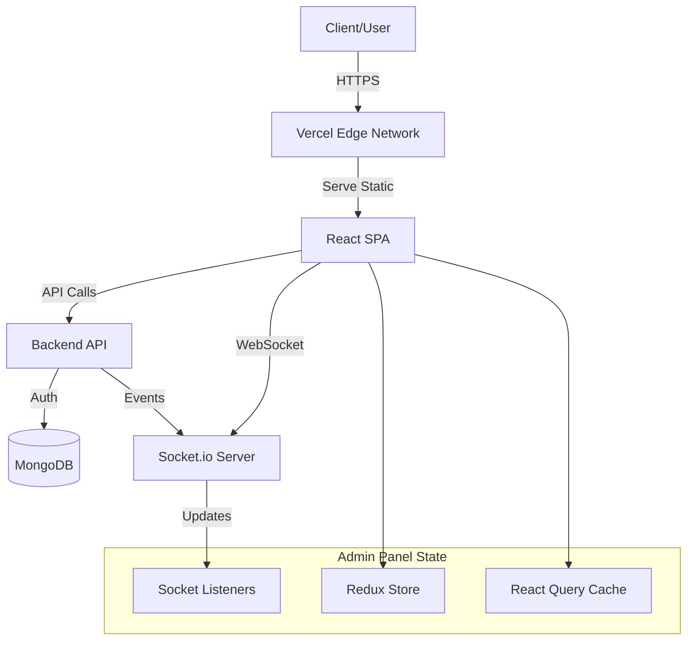
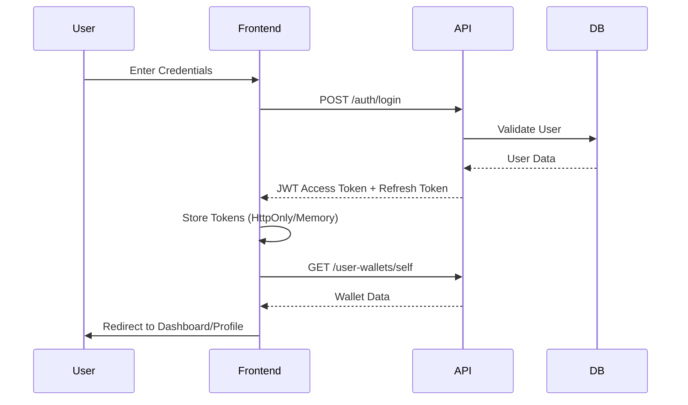
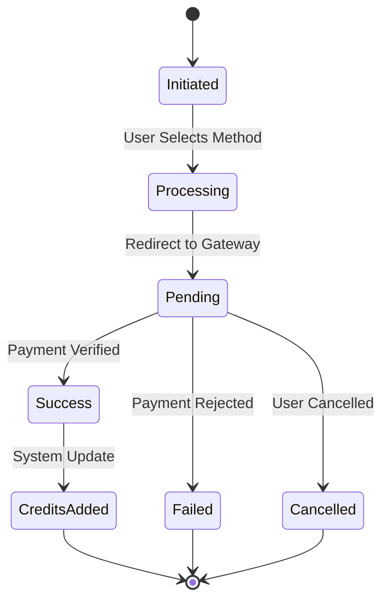

# ZaaZ Admin Panel

A modern, enterprise-grade admin panel for managing the Admin Panel platform. Built with **React 19**, **TypeScript**, and **Modern Web Technologies**, this system provides comprehensive management capabilities for users, financial transactions, credits, AI models, and document processing services. It functions as the central command center for the entire platform, featuring real-time analytics, role-based security, and a modular architecture.

## Features

### Dashboard

The dashboard serves as the nerve center for the application, aggregating data from various modules into a unified view.

- **Comprehensive Analytics Dashboard**: Modern admin dashboard with real-time statistics and charts.
- **Statistics Cards**: Four key metric cards showing total revenue (USD/BDT), total users, total transactions, and total credits with month-over-month trends.
- **Revenue Trend Chart**: Area chart displaying daily revenue trends over time (USD and BDT).
- **Transaction Status Chart**: Bar chart showing distribution of transactions by status.
- **Payment Method Performance Chart**: Bar chart displaying transaction count and revenue by payment method.
- **Credits Flow Chart**: Line chart showing daily credit increases vs decreases.
- **User Growth Chart**: Area chart displaying daily user registrations.
- **Package Performance Chart**: Bar chart showing purchase count and revenue per package.
- **Feature Performance Chart**: Bar chart displaying usage count and total credits used per feature.
- **Real-time Updates**: Dashboard data updates in real-time via Socket.io.

### User Administration

Comprehensive tools for managing the user lifecycle and security.

- **Role-Based Access Control (RBAC)**:
  - **Super Admin**: unrestricted access to all system configurations.
  - **Admin**: Operational access for day-to-day management.
  - **User**: Restricted access to personal profile and own data.
- **Profile Management**: Detailed views of user activities, wallet status, and transaction history.
- **Security**: Account blocking, verification status management, and activity logging.
- **User Details Page**: Separate admin-only page for viewing user details (read-only).
- **Profile Page**: User's own profile page with edit capabilities and `/self` API endpoints.
- **Role-based Layout Access**: CommonLayout automatically redirects non-admin users to client profile.

### Service Management (Features & AI)

Configuration for the core services offered by the platform.

- **Features Page**: List, create, edit, and delete system features.
- **Features Details Page**: View feature details and manage associated endpoints.
- **Feature Endpoints Management**: Create, edit, and delete API endpoints with credit requirements.
- **Feature Popups**: Manage informational popups associated with features.
- **Feature Usage Logs**: Track detailed usage logs for features.
- **Parent-Child Relationships**: Organize features hierarchically.
- **AI Models Page**: Manage AI models available in the system.
- **Model Configuration**: Configure model parameters and costs.
- **Plagiarism Checking**: Management interface for document ingestion and checking status.
- **Billing Settings**: Global configuration for system-wide billing rules.
- **Status Control**: Activate/deactivate features and endpoints.

### Financial Management (Packages & Plans)

Tools for managing the monetary aspects of the platform.

- **Packages Page**: Complete CRUD operations for credit packages.
- **Packages Details Page**: View package details and all associated plans.
- **Rich Text Editor**: BlockNote integration for HTML content editing.
- **Feature Association**: Link packages to multiple features.
- **Plan Selection**: Select multiple plans per package with individual pricing and credit amounts.
- **Package-Plan Management**: Manage plan associations, set initial plan, configure prices and credits per plan.
- **Package History**: View complete change history with embedded feature and plan data via modal.
- **Plans Page**: Complete CRUD operations for reusable plan templates.
- **Plan Reusability**: Use same plan across multiple packages.
- **Pricing Configuration**: Set individual prices (USD/BDT) per plan per package.
- **Initial Plan**: Designate one plan as initial per package.

### Payment & Transactions

A robust flow handling multiple gateways and transaction states.

- **Payment Methods Page**: Configure and manage payment gateway settings.
- **Gateway Configuration**: Set up Stripe and SSL Commerz payment methods.
- **Test Mode Support**: Configure test/sandbox mode for payment gateways.
- **Payment Transactions Page**: View and filter all payment transactions.
- **Status Tracking**: Monitor payment status (pending, completed, failed, etc.).
- **Gateway Integration**: View payment gateway details (Stripe/SSL Commerz).
- **Filtering & Search**: Advanced filtering by status, gateway, user, date range.
- **Transaction Details**: View complete transaction information via modal.

### Credits System

The core currency of the platform, managed with precision.

- **Credits Transactions Page**: Track all credit movements.
- **Transaction Types**: View increases (payments, bonuses) and decreases (feature usage).
- **User Filtering**: Filter transactions by user.
- **Real-time Updates**: Live credit balance updates via Socket.io.
- **Credits Usage Page**: Monitor how credits are being consumed across the system.
- **Detailed Tracking**: Granular views of credit consumption by user and feature.
- **Usage Statistics**: Analyze usage patterns.
- **Credits Profits Page**: Configure profit percentages for credit sales.
- **User Wallets Page**: Manage all user wallets.
- **Balance Tracking**: View current credit balances.
- **Coupon Management**: Create and manage discount coupons with expiry and limits.

### Client-Side Payment Flow

- **Pricing Page** (`/client/pricing`): Display all public packages with plan tabs (All + individual plans).
  - Plan filtering via tabs.
  - Display all plans or specific plan based on selection.
  - Initial plan price/duration shown on package cards.
  - Checkout link includes `plan_id` parameter.
- **Checkout Page** (`/client/checkout`): Select plan and payment method, initiate payment.
  - Plan selection UI with all available plans.
  - Display plan details (price, duration, credits).
  - Payment initiation requires `plan_id`.
- **Checkout Success Page** (`/client/checkout/success`): Display payment success confirmation.
- **Checkout Cancel Page** (`/client/checkout/cancel`): Handle payment cancellation/failure.
- **Client Layout**: Dedicated layout for user-facing pages.
- **Payment Status Handling**: Complete payment flow with status management.

### Recycle Bin

- **Soft-Deleted Items Management**: View all soft-deleted items.
- **Multi-Module Support**: Manage deleted items from Features, Packages, Users, etc.
- **Restore Functionality**: Restore deleted items with one click.
- **Permanent Delete**: Permanently delete items from the system.
- **Statistics**: View counts of deleted items per module.
- **Tabbed Interface**: Easy navigation between different module types.

### Real-time Features

- **Real-time Notifications**: Live notification system with Socket.io integration.
- **Live Updates**: Real-time data synchronization across all connected clients.
- **Notification Management**: Custom notification center with read/unread status.
- **Credit Balance Updates**: Real-time wallet balance updates.
- **Payment Status Updates**: Live payment transaction status changes.

## System Architecture

### High-Level Architecture

<div align="center">



_Figure 1: High-level architectural overview showing the data flow between the Client, API, Database, and Real-time services._

</div>

### Authentication Flow

The system uses a secure, token-based authentication mechanism.

<div align="center">



_Figure 2: Sequence diagram illustrating the secure login process, token storage, and initial data fetching._

</div>

### Payment Flow

A robust flow handling multiple gateways and transaction states.

<div align="center">



_Figure 3: State transition diagram for payment transactions, covering all possible outcomes from initiation to finalization._

</div>

## Technology Stack

### Core Framework

- **React 19** - Latest React with concurrent features.
- **TypeScript** - Type-safe development.
- **Vite** - Fast build tool and development server.

### Styling & UI

- **Tailwind CSS 4** - Utility-first CSS framework.
- **Custom Component Library** - **Most components are custom-built** with minimal third-party dependencies.
- **Lucide React** - Icon library (only major UI dependency).
- **BlockNote** - Rich text editor for HTML content.

### State Management

- **Redux Toolkit** - Predictable state management.
- **React Query (TanStack Query)** - Server state management and caching.

### Routing & Navigation

- **React Router 7** - Client-side routing.
- **Custom RouteMenu Class** - Dynamic route generation with role-based access control.

### Form Management

- **React Hook Form** - Performant forms with easy validation.
- **Zod** - TypeScript-first schema validation.
- **Hookform Resolvers** - Validation integration.

### Data Visualization

- **Recharts** - Charts and data visualization.
  - Area charts for revenue trends and user growth.
  - Bar charts for transaction status, payment methods, packages, and features.
  - Line charts for credit flow.

### Additional Libraries

- **Axios** - HTTP client for API requests.
- **Socket.io Client** - Real-time communication.
- **React Toastify** - Toast notifications.
- **Date-fns** - Date manipulation utilities.
- **Class Variance Authority** - Component variant management.
- **Embla Carousel** - Touch-friendly carousel component.

## Project Structure

```text
src/
├── assets/            # Static assets and data
│   ├── data/         # Route menu items configuration
│   └── styles/       # Global styles and CSS files
├── builder/          # Builder classes (RouteMenu, ObjectFormData)
├── components/       # Reusable UI components
│   ├── (auth)/      # Authentication components
│   ├── (common)/    # Common page components
│   │   ├── features-page/
│   │   ├── packages-page/
│   │   ├── payment-methods-page/
│   │   ├── payment-transactions-page/
│   │   ├── credits-transactions-page/
│   │   ├── credits-profits-page/
│   │   ├── user-wallets-page/
│   │   ├── users-page/
│   │   ├── dashboard/
│   │   ├── recycle-bin-page/
│   │   └── ...
│   ├── appliers/    # State appliers and providers
│   ├── cards/       # Card components
│   ├── modals/      # Modal dialogs
│   │   ├── FeatureAddModal/
│   │   ├── FeatureEditModal/
│   │   ├── PackageAddModal/
│   │   ├── PaymentTransactionViewModal/
│   │   └── ...
│   ├── partials/    # Layout partials (Header, Sidebar, etc.)
│   ├── sections/    # Page sections
│   ├── ui/          # Base UI components
│   │   ├── BlockNoteEditor/  # Rich text editor
│   │   ├── Button/
│   │   ├── Card/
│   │   ├── DataTable/
│   │   ├── FormControl/
│   │   ├── Modal/
│   │   └── ...
│   └── wrappers/    # Component wrappers
├── config/          # Configuration files
│   ├── constants/   # App constants
│   ├── env/         # Environment variables
│   ├── project/     # Project metadata
│   ├── seo/         # SEO configuration
│   └── urls/        # URL configuration
├── hooks/           # Custom React hooks
│   ├── observers/   # Intersection and mutation observers
│   ├── states/      # State management hooks
│   ├── ui/          # UI-related hooks
│   └── utils/       # Utility hooks
├── layouts/         # Page layouts
│   ├── CommonLayout.tsx  # Admin panel layout (with role validation)
│   ├── ClientLayout.tsx  # Client-facing layout
│   └── AuthLayout.tsx   # Auth pages layout
├── lib/             # Library utilities (API, utils)
├── pages/           # Page components
│   ├── (auth)/     # Authentication pages
│   ├── (common)/    # Common pages (admin)
│   ├── (client)/    # Client-facing pages
│   ├── (partial)/   # Partial pages (Error, 404, etc.)
│   └── (user)/      # User-specific pages
├── redux/           # Redux store and slices
│   ├── slices/      # Redux slices for each page/module
│   └── store.ts     # Redux store configuration
├── services/        # API service functions
├── types/           # TypeScript type definitions
└── utils/           # Utility functions
```

## Custom Architecture

### Custom-Built Components

This project emphasizes **custom-built components** with minimal third-party dependencies. Most UI components, including data tables, forms, modals, and layout components, are built from scratch to ensure:

- **Performance optimization** tailored to specific use cases.
- **Consistent design system** across the application.
- **Full control** over component behavior and styling.
- **Reduced bundle size** by avoiding unnecessary third-party code.

### RouteMenu Class

The **RouteMenu class** is a custom routing solution that provides:

- **Dynamic route generation** based on user roles and permissions.
- **Role-based access control** for different user types.
- **Nested routing structure** with automatic layout application.
- **Menu integration** with route definitions.
- **Type-safe routing** with TypeScript support.

### Redux & React Query

The application uses a hybrid state management approach:

- **Redux Toolkit**: Manages synchronous client state like modal visibility, form inputs, pagination, and user preferences.
- **React Query**: Manages asynchronous server state, handling caching, background updates, and network error states.

## Getting Started

### Prerequisites

- **Node.js** (v18 or higher)
- **pnpm** (recommended) or npm
- **Git**

### Installation

1. **Clone the repository**

   ```bash
   git clone <repository-url>
   cd payment-system
   cd adminpanel
   ```

2. **Install dependencies**

   ```bash
   pnpm install
   # or
   npm install
   ```

3. **Environment Setup**
   Create a `.env` file in the root directory:

   ```env
   VITE_API_URL=http://localhost:5000
   VITE_APP_URL=http://localhost:8080
   ```

4. **Start development server**

   ```bash
   pnpm dev
   # or
   npm run dev
   ```

5. **Open your browser**
   Navigate to `http://localhost:8080`

### Build for Production

```bash
pnpm build
# or
npm run build
```

### Preview Production Build

```bash
pnpm preview
# or
npm run preview
```

## Available Scripts

- `pnpm dev` - Start development server
- `pnpm build` - Build for production
- `pnpm preview` - Preview production build
- `pnpm lint` - Run ESLint
- `pnpm lint:fix` - Fix ESLint errors automatically

## Support & License

For support, please create an issue in the repository or contact the development team.

---

**Built with using React 19, TypeScript, Tailwind CSS, and Redux Toolkit**
