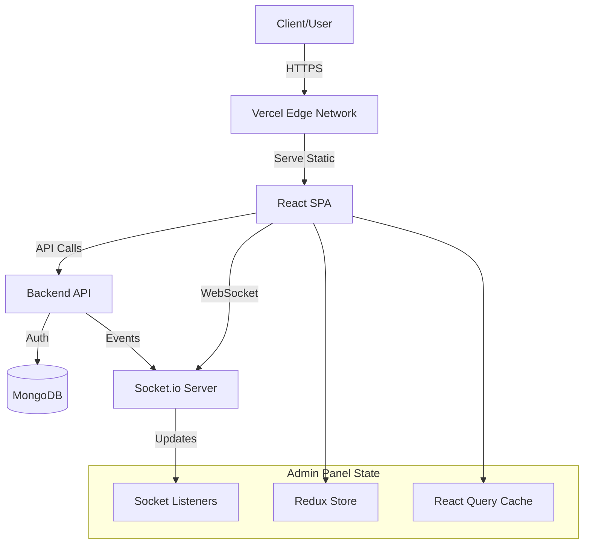
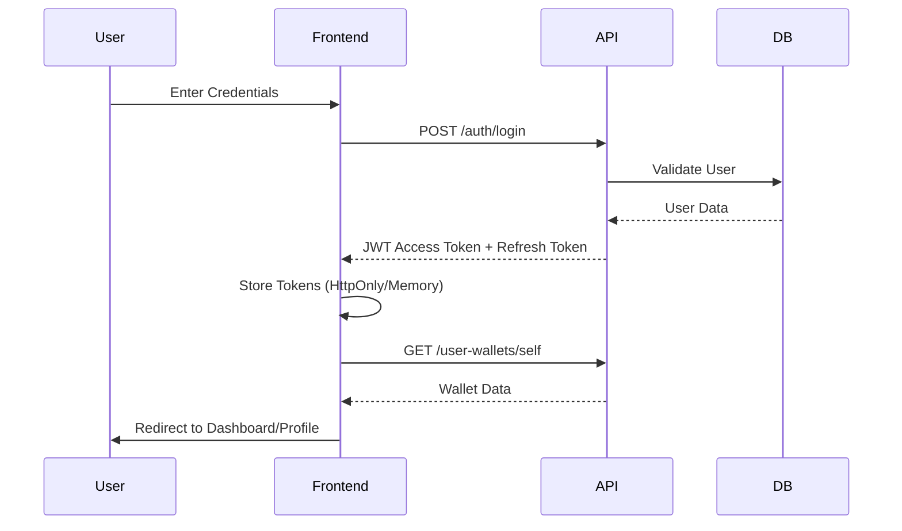
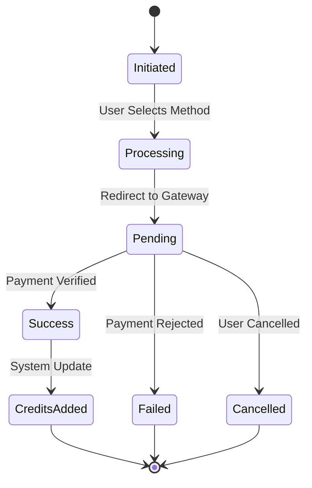

# ZaaZ Admin Panel

A modern, enterprise-grade admin panel for managing the ZaaZ platform. Built with **React 19**, **TypeScript**, and **Tailwind CSS 4**, this system provides comprehensive management capabilities for users, financial transactions, credits, AI models, contacts, files, and document processing services. It functions as the central command center for the entire platform, featuring real-time analytics, role-based security, and a modular architecture.

## Features

### Dashboard

The dashboard serves as the nerve center of the application, aggregating data from all modules into a unified view.

- **Comprehensive Analytics Dashboard**: Modern admin dashboard with real-time statistics and charts.
- **Statistics Cards**: Key metric cards showing total revenue (USD/BDT), total users, total transactions, and total credits with month-over-month trends.
- **Revenue Trend Chart**: Area chart displaying daily revenue trends over time (USD and BDT).
- **Transaction Status Chart**: Bar chart showing distribution of transactions by status.
- **Payment Method Performance Chart**: Bar chart displaying transaction count and revenue by payment method.
- **Credits Flow Chart**: Line chart showing daily credit increases vs decreases.
- **User Growth Chart**: Area chart displaying daily user registrations.
- **Package Performance Chart**: Bar chart showing purchase count and revenue per package.
- **Feature Performance Chart**: Bar chart displaying usage count and total credits used per feature.
- **Real-time Updates**: Dashboard data updates in real-time via Socket.io.

### User Administration

Comprehensive tools for managing the user lifecycle and security.

- **Role-Based Access Control (RBAC)**:
  - **Super Admin**: Unrestricted access to all system configurations.
  - **Admin**: Operational access for day-to-day management.
  - **User**: Restricted access to personal profile and own data.
- **Profile Management**: Detailed views of user activities, wallet status, and transaction history.
- **Security**: Account blocking, verification status management, and activity logging.
- **User Details Page**: Admin-only read-only page with user info, wallet status, and all transaction tabs (payments, credits, packages).
- **Profile Page**: User's own profile page with edit capabilities and `/self` API endpoints.
- **Role-based Layout Access**: `CommonLayout` automatically redirects non-admin users to client profile.

### User Wallets

Manage credit balances for every user in the system.

- **Wallet List Page**: DataTable of all user wallets with email, user ID, credit balance, and onboarding status.
- **Initial Credits Status**: Visual indicator showing whether a user has received their initial free credits.
- **Initial Package Status**: Visual indicator showing whether a user has received their initial package assignment.
- **Wallet Details Page**: Detailed view with tabbed history — package transactions, payment transactions, and credits transactions.
- **Give Bonus Credits**: Assign additional credits directly to a user's wallet from the details page.
- **Assign Package**: Assign a package to a user directly from the wallet details page.
- **Subscription Context**: Active package context is derived from the latest package transaction record.

### Service Management (Features & AI)

Configuration for the core services offered by the platform.

- **Features Page**: List, create, edit, and delete system features.
- **Features Details Page**: View feature details and manage associated endpoints.
- **Feature Endpoints Management**: Create, edit, and delete API endpoints with credit requirements.
- **Feature Popups**: Manage informational popups associated with features.
- **Feature Usage Logs**: Track detailed usage logs per feature.
- **Parent-Child Relationships**: Organize features hierarchically.
- **AI Models Page**: Manage AI models with CRUD operations and model configuration.
- **Billing Settings**: Global configuration for system-wide billing rules with full change history.
- **Feature Feedback Management**:
  - Centralized dashboard for reviewing user suggestions, bugs, and compliments.
  - Interactive preview modal for reading full feedback and rating analysis.
  - Administrative response system via `admin_note` field.
  - Status management (Resolved, Reviewed, Pending) with bulk update support.
  - Page-level bulk deletion for efficient maintenance.
- **Status Control**: Activate/deactivate features and endpoints.

### Financial Management (Packages & Plans)

Tools for managing the monetary aspects of the platform.

- **Packages Page**: Complete CRUD operations for credit packages with rich-text descriptions.
- **Packages Details Page**: View package details and all associated pricing plans.
- **Package Prices Page**: Manage all package–interval price combinations in one place.
- **Rich Text Editor**: BlockNote integration for HTML content editing.
- **Feature Association**: Link packages to multiple features.
- **Interval Selection**: Select multiple billing intervals per package with individual pricing and credit amounts.
- **Package History**: View complete change history with embedded feature and interval data via modal.
- **Package Feature Configuration**: Dynamic configuration system for package-specific feature behavior.
  - Configure minimum/maximum credits per feature or endpoint.
  - Set daily and monthly usage limits per package.
  - Define quality tiers (basic, standard, premium) for different packages.
  - Endpoint-specific overrides for granular control.
- **Plans / Intervals Page**: Complete CRUD operations for reusable billing interval templates.
- **Coupon Management**: Create and manage discount coupons with expiry dates and usage limits.

### Payment & Transactions

A robust flow handling multiple gateways and transaction states.

- **Payment Methods Page**: Configure and manage payment gateway settings (Stripe, SSL Commerz).
- **Test Mode Support**: Configure test/sandbox mode per payment gateway.
- **Payment Transactions Page**: View, filter, and inspect all payment transactions.
- **Status Tracking**: Monitor payment status (pending, completed, failed, cancelled, etc.).
- **Package Transactions Page**: Track all package assignment records per user.
- **Filtering & Search**: Advanced filtering by status, gateway, user, and date range.
- **Transaction Details**: View complete transaction information in a modal.

### Credits System

The core currency of the platform, managed with precision.

- **Credits Transactions Page**: Track all credit movements with type classification (increase / decrease).
- **Credits Usages Page**: Monitor granular credit consumption by user and feature.
- **Credits Profits Page**: Configure and view profit percentages for credit sales with full change history.
- **Real-time Updates**: Live credit balance updates via Socket.io.

### Contacts

- **Contacts Page**: View all inbound contact form submissions.
- **Sender Details**: Displays sender name, email address, subject, and message body.
- **Full Message View**: Modal with whitespace-preserved message rendering.
- **Soft Delete**: Remove contacts with confirmation dialog; deleted items recoverable via Recycle Bin.

### Files

- **Files Page**: Browse and manage all files uploaded to the platform.
- **File Type Icons**: Visual indicators for images, videos, PDFs, and generic documents.
- **Image Thumbnails**: Inline preview for image/* MIME types.
- **Statistics Cards**: Total files, total storage used, image count, and cloud-hosted file count.
- **Provider Badges**: Distinguish between local storage and Google Cloud Storage (GCS) files.
- **Status Badges**: File status (active, inactive, archived) with colour coding.
- **External Links**: Open files directly via provider URL.
- **Soft Delete**: Remove files with confirmation; recoverable via Recycle Bin.

### Recycle Bin

Unified soft-delete recovery centre covering all deletable modules.

- **13 Module Types**: Features, Feature Endpoints, Packages, Credits Profits, Users, Package Transactions, AI Models, Intervals, Payment Methods, Payment Transactions, Billing Settings, Contacts, Files.
- **Tabbed Interface**: Per-module tabs with item counts shown on each tab trigger.
- **Restore**: Recover any soft-deleted item with a single click.
- **Permanent Delete**: Irreversibly remove an item with a confirmation dialog.
- **Statistics Overview**: Counts of deleted items per module displayed at the top.
- **Date Range Filtering**: Filter deleted items by creation date range.

### Real-time Features

- **Live Notifications**:
  - Real-time sidebar badge showing unread notification count with pulse animation.
  - Instant synchronisation across all tabs via Redux and Socket.io.
  - In-app desktop notifications for high-priority alerts.
- **Notification Centre**:
  - List view with status filtering (all / unread / read).
  - `NotificationViewModal` with deep-link and metadata support.
  - Bulk actions: "Mark All Read" and "Clear All".
- **Credit Balance Updates**: Real-time wallet balance updates.
- **Payment Status Updates**: Live payment transaction status changes.

### Client-Side Payment Flow

- **Pricing Page** (`/client/pricing`): Display all public packages with plan tabs (All + individual intervals).
- **Checkout Page** (`/client/checkout`): Select interval and payment method, initiate payment.
- **Checkout Success / Cancel Pages**: Handle post-payment redirects.
- **Client Layout**: Dedicated layout for user-facing pages.

---

## System Architecture

### High-Level Architecture

<div align="center">


```mermaid
graph TD
    User[Client/User] -->|HTTPS| CDN[Vercel Edge Network]
    CDN -->|Serve Static| ClientApp[React SPA]
    ClientApp -->|API Calls| API[Backend API]
    ClientApp -->|WebSocket| Socket[Socket.io Server]

    subgraph "Admin Panel State"
        Redux[Redux Store]
        Query[React Query Cache]
        SocketState[Socket Listeners]
    end

    ClientApp --> Redux
    ClientApp --> Query

    API -->|Auth| DB[(MongoDB)]
    API -->|Events| Socket
    Socket -->|Updates| SocketState
```

_Figure 1: High-level architectural overview showing the data flow between the Client, API, Database, and Real-time services._

</div>

### Authentication Flow

<div align="center">


```mermaid
sequenceDiagram
    participant User
    participant Frontend
    participant API
    participant DB

    User->>Frontend: Enter Credentials
    Frontend->>API: POST /auth/login
    API->>DB: Validate User
    DB-->>API: User Data
    API-->>Frontend: JWT Access Token + Refresh Token
    Frontend->>Frontend: Store Tokens (HttpOnly/Memory)
    Frontend->>API: GET /user-wallets/self
    API-->>Frontend: Wallet Data
    Frontend->>User: Redirect to Dashboard/Profile
```

_Figure 2: Sequence diagram illustrating the secure login process, token storage, and initial data fetching._

</div>

### Payment Flow

<div align="center">


```mermaid
stateDiagram-v2
    [*] --> Initiated
    Initiated --> Processing: User Selects Method
    Processing --> Pending: Redirect to Gateway
    Pending --> Success: Payment Verified
    Pending --> Failed: Payment Rejected
    Pending --> Cancelled: User Cancelled
    Success --> CreditsAdded: System Update
    CreditsAdded --> [*]
    Failed --> [*]
    Cancelled --> [*]
```

_Figure 3: State transition diagram for payment transactions, covering all possible outcomes._

</div>

---

## Technology Stack

### Core Framework

| Library | Version | Purpose |
|---------|---------|---------|
| React | 19 | UI framework with concurrent features |
| TypeScript | 5.x | Type-safe development |
| Vite | 6.x | Build tool and dev server |

### Styling & UI

- **Tailwind CSS 4** — Utility-first CSS framework.
- **Custom Component Library** — All major UI components are custom-built (DataTable, Modal, Card, Tabs, Pagination, Badge, Button, etc.).
- **Lucide React** — Icon library.
- **BlockNote** — Rich text editor for HTML content.

### State Management

- **Redux Toolkit** — Synchronous client state (modal visibility, pagination, filters, form inputs).
- **TanStack React Query** — Asynchronous server state with caching and background refetch.

### Routing & Navigation

- **React Router 7** — Client-side routing.
- **Custom `RouteMenu` Class** — Dynamic route and sidebar generation with RBAC.

### Form Management

- **React Hook Form** — Performant forms.
- **Zod** — TypeScript-first schema validation.
- **Hookform Resolvers** — Validation integration.

### Data Visualisation

- **Recharts** — Area, bar, and line charts for analytics dashboards.

### Additional Libraries

- **Axios** — HTTP client.
- **Socket.io Client** — Real-time communication.
- **React Toastify** — Toast notifications.
- **Date-fns** — Date utilities.
- **Class Variance Authority** — Component variant management.

---

## Project Structure

```text
src/
├── assets/
│   ├── data/               # Route and menu item definitions
│   └── styles/             # Global CSS
├── builder/                # RouteMenu and ObjectFormData builder classes
├── components/
│   ├── (auth)/             # Login / auth UI components
│   ├── (common)/           # Page-specific section components
│   │   ├── dashboard/
│   │   ├── features-page/
│   │   ├── packages-page/
│   │   ├── payment-methods-page/
│   │   ├── payment-transactions-page/
│   │   ├── package-transactions-page/
│   │   ├── credits-transactions-page/
│   │   ├── credits-profits-page/
│   │   ├── user-wallets-page/
│   │   ├── users-page/
│   │   ├── feature-feedbacks-page/
│   │   ├── recycle-bin-page/
│   │   └── ...
│   ├── modals/             # All modal dialogs
│   ├── partials/           # Header, Sidebar, Footer
│   ├── sections/           # Shared section components (PageHeader, etc.)
│   ├── ui/                 # Base design-system components
│   │   ├── DataTable/      # Feature-rich table (sorting, pagination, row selection, bulk actions)
│   │   ├── BlockNoteEditor/
│   │   ├── Button/
│   │   ├── Card/
│   │   ├── Modal/
│   │   ├── Tabs/
│   │   ├── Pagination/
│   │   ├── Badge/
│   │   └── ...
│   └── wrappers/           # AuthWrapper and layout wrappers
├── config/                 # Env vars, constants, SEO, URL config
├── hooks/                  # Custom hooks (observers, states, ui, utils)
├── layouts/
│   ├── CommonLayout.tsx    # Admin panel layout with role validation
│   ├── ClientLayout.tsx    # User-facing layout
│   └── AuthLayout.tsx      # Auth pages layout
├── lib/                    # Axios instance, utilities
├── pages/
│   ├── (auth)/             # Login page
│   ├── (common)/           # Admin pages
│   │   ├── Dashboard/
│   │   ├── UsersPage/
│   │   ├── UserDetailsPage/
│   │   ├── UserWalletsPage/
│   │   ├── UserWalletsDetailsPage/
│   │   ├── FeaturesPage/
│   │   ├── FeaturesDetailsPage/
│   │   ├── AiModelsPage/
│   │   ├── PlansPage/
│   │   ├── PackagesPage/
│   │   ├── PackagesDetailsPage/
│   │   ├── PackagePlansPage/
│   │   ├── CouponsPage/
│   │   ├── FeaturePopupsPage/
│   │   ├── PaymentMethodsPage/
│   │   ├── CreditsProfitsPage/
│   │   ├── CreditsProfitsDetailsPage/
│   │   ├── BillingSettingsPage/
│   │   ├── PaymentTransactionsPage/
│   │   ├── PaymentTransactionsDetailsPage/
│   │   ├── PackageTransactionsPage/
│   │   ├── CreditsTransactionsPage/
│   │   ├── CreditsTransactionsDetailsPage/
│   │   ├── CreditsUsagesPage/
│   │   ├── FeatureUsageLogsPage/
│   │   ├── ContactsPage/
│   │   ├── FilesPage/
│   │   ├── NotificationsPage/
│   │   ├── FeatureFeedbacksPage/
│   │   └── RecycleBinPage/
│   ├── (client)/           # User-facing pricing and checkout pages
│   ├── (partial)/          # 404, error pages
│   └── (user)/             # ProfilePage
├── redux/
│   ├── slices/             # One slice per page/module
│   └── store.ts
├── services/               # API service functions per module
├── types/                  # TypeScript type definitions
└── utils/                  # Shared utility functions
```

---

## Custom Architecture

### DataTable Component

The `DataTable` component is a fully custom-built, feature-rich table that powers every list view in the admin panel.

- **Animated Sort Icons**: Smooth scale/opacity transitions between `ArrowUpDown`, `ArrowUp`, and `ArrowDown` states.
- **Row Selection**: Optional checkbox selection per row with select-all (supports indeterminate state).
- **Bulk Actions Bar**: Contextual action bar that appears when one or more rows are selected.
- **Pagination**: Configurable page size with server-side or client-side processing.
- **Search & Sort**: Controlled externally via Redux slices or handled internally via `config` flags.
- **Empty State**: Descriptive "No data found / Try adjusting your search or filters" placeholder.
- **Loading / Error States**: Skeleton loader and error boundary variants.

### RouteMenu Class

The `RouteMenu` class is a custom routing solution providing:

- **Dynamic route generation** based on user roles and permissions.
- **Sidebar menu generation** derived directly from route definitions.
- **Nested routing** with automatic layout application.
- **Type-safe routing** with TypeScript.

### Redux + React Query Hybrid

- **Redux Toolkit**: Owns UI state — modal open/close, active tab, pagination offsets, filter values.
- **React Query**: Owns server state — fetching, caching, background refetch, and error handling.
- Each page module has a dedicated Redux slice (e.g., `recycle-bin-page-slice`, `user-wallets-page-slice`) keeping concerns isolated.

---

## Getting Started

### Prerequisites

- **Node.js** v18 or higher
- **pnpm** (recommended) or npm

### Installation

1. **Clone the repository**

   ```bash
   git clone <repository-url>
   cd zaaz-adminpanel
   ```

2. **Install dependencies**

   ```bash
   pnpm install
   ```

3. **Environment setup** — create `.env` in the project root:

   ```env
   VITE_API_URL=http://localhost:5000
   VITE_APP_URL=http://localhost:8080
   ```

4. **Start the development server**

   ```bash
   pnpm dev
   ```

5. Open `http://localhost:8080` in your browser.

### Build for Production

```bash
pnpm build
```

### Preview Production Build

```bash
pnpm preview
```

## Available Scripts

| Script | Description |
|--------|-------------|
| `pnpm dev` | Start development server |
| `pnpm build` | Build for production |
| `pnpm preview` | Preview production build |
| `pnpm lint` | Run ESLint |
| `pnpm lint:fix` | Auto-fix ESLint errors |

---

## Support

For support, please open an issue in the repository or contact the development team.

---

**Built with React 19, TypeScript, Tailwind CSS 4, and Redux Toolkit**
